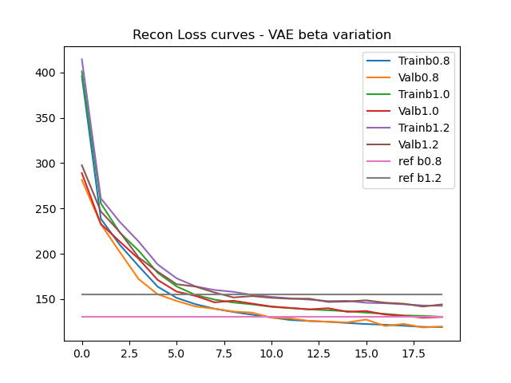
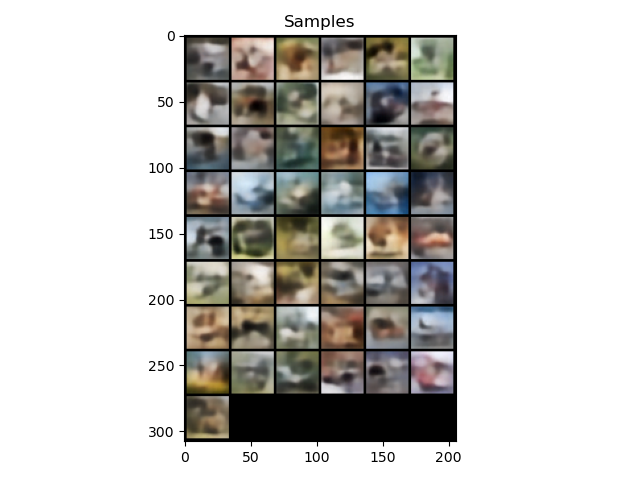
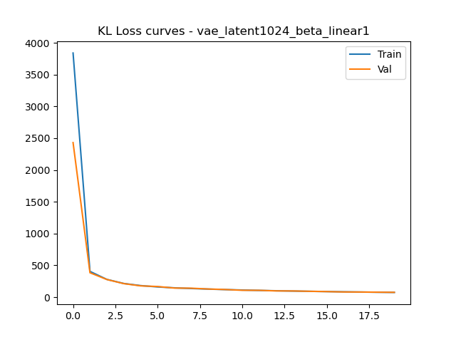

## Software setup

Use Python 3.8.

Please run `pip install -r requirements.txt` to install the necessary dependencies. Then run:

```
cd gan/
mkdir datasets/
gdown https://drive.google.com/uc\?id\=1hbzc_P1FuxMkcabkgn9ZKinBwW683j45 -O datasets/
tar zxvf datasets/CUB_200_2011.tgz
mv CUB_200_2011/ datasets/
python resize_dataset.py --input_folder datasets/CUB_200_2011/images --output_folder datasets/CUB_200_2011_32/ --res 32
rm -rf datasets/cub.tgz
rm -rf datasets/CUB_200_2011_32/Mallard_0130_76836.jpg datasets/CUB_200_2011_32/Brewer_Blackbird_0028_2682.jpg datasets/CUB_200_2011_32/Clark_Nutcracker_0020_85099.jpg datasets/CUB_200_2011_32/Ivory_Gull_0040_49180.jpg datasets/CUB_200_2011_32/Pelagic_Cormorant_0022_23802.jpg datasets/CUB_200_2011_32/Western_Gull_0002_54825.jpg datasets/CUB_200_2011_32/Ivory_Gull_0085_49456.jpg datasets/CUB_200_2011_32/White_Necked_Raven_0070_102645.jpg
cp cub_clean_custom_na.npz /path/to/python_env/lib/python3.8/site-packages/cleanfid/stats/cub_clean_custom_na.npz
```

## Generative Adversarial Networks

### Simple GAN loss

In this section, we test the performance of the original GAN losses for the generator and discriminator as described in Algorithm 1 of [1]((https://arxiv.org/pdf/1406.2661.pdf))


**Final FID attained is 146**. However as can be seen from the graph ahead the FID had gone < 60 around iterations 23k - 25k. This indicates some form of overfitting is happening. From the samples below we can see some form of mode collapse happening.


### Samples At iteration 30k


### Samples At iteration 23k


As we can see the results at iteration 23k are better than those at 30k, however many of the generated images might look birdlike from a distance but upon zooming in they are unnatural.

**Below I have plotted it interpolations at iteration 30k and at 23k and it is clear that the interpolations at 23k are better. The colours are more nature oriented as would be seen with birds and there is more variation by varying just the first two dimensions of the laten space. I would say that at 30k there is hardly any disentagling but at 23k there is slightly better disentangling**

### Interpolations At iteration 30k


<!-- ### At iteration 30k but varying two latent dims from (-3,3) instead of (-1,1)
 -->

### Interpolations At iteration 23k


**Discussion** Since the loss function is binary cross entropy, there is a sigmoid function coming into play here due to which the problem of vanishing gradients is a problem. While in this round of training I was lucky enough to witness a duration of stable training, the model eventually did run into vanishing gradients causing the training to worsen, it could've been the generator loss function that ran into the problem (poorer samples) or the discrimator part (poorer checks leading to poorer samples by the generator).

##  LSGAN loss

LSGAN loss is implemented as per equation (2) as the loss for the generator and discriminator with c=1 in [2](https://arxiv.org/pdf/1611.04076.pdf). 

**The final FID attained is  52.57**


The FID is much better than the simple GAN loss. I also verified that my upsample and downsample were inversions of each other through unittesting so I'm confident the implementation was correct.

### Samples At iteration 30k


These are much better samples than were generated by the previous model at 30k iterations. But there are still some strange samples generated. The ones that do look like birds are more natural looking and believable.

### Samples at iteration 29k


<!-- **Q**{How does the latent space interpolation look, is the latent space disentangled at all?}
\A{} -->
### Interpolations At 30k iterations


### At iteration 30k but varying two latent dims from (-3,3) instead of (-1,1)


The latent space generated from (-1, 1) (first image) looks a little bird like but doesn't seem all that disentangled, that being said the choice to pick the first two hidden dimensions is arbitrary and unlike some other deterministic dimensionality rediction algorith like PCA it is not guaranteed that the first two dimensions will be the most meaningful.

**Discussion** This version of GAN loss was more stable because it used mse loss without any sigmoid activations leading to better gradients more consistently as the problem of vanishing gradients is avoided.


## WGAN-GP loss

Here I use the generator and discriminator losses from Algorithm 1 in WGAN-GP paper [3](https://arxiv.org/pdf/1704.00028.pdf).

**The final FID obtained is 38.6.**


### Samples At iteration 30k


### Interpolations At 30k iterations


### At iteration 30k but varying two latent dims from (-3,3) instead of (-1,1)


Here we got a little lucky! though the first two latent dimensions are being altered for both attempts, the rest of the randomly generated vector would not have been the same between the above two images, nevertheless the generation is certainly shows a birdlike - batlike variation while keeping the sky constant. This shows that this model is better at latent space disentanglement than the first two.


**Discussion** The previous loss function overcame the problem of vanishing gradients by using MSE Loss however there are two issues still unaddressed:
- Mseloss can still have exploding gradients as gradients are unclipped leading to training instability
- MSEloss never truly converges as the gradients vanish as they approach prediction approaches the true value (this is not a problem with BCE loss)

Hence in the WGAN-GP loss we bring back the BCE loss as the GAN objective and additionally impose a loss on the norm of the gradient of the loss such that it is close to 1.0. From the graph of a sigmoid it is clear that sigmoid's behaviour can be linear near zero input and this is the region in which it is most beneficial to train a network which has sigmoids in it. Therefore this loss avoid the issue of both vanishing and exploding gradients to have the most stable training we have seen among the three losses.

# Variational Autoencoders

## AutoEncoders


### Latent Dim 16
Reconstruction quality at epoch 19 of training


### Latent Dim 128
Reconstruction quality at epoch 19 of training


### Latent Dim 1024
Reconstruction quality at epoch 19 of training


#### The latent size 1024 performs the best primarily because the details in the image are subjected to lesser compression. Similar to when we reduce file sizes of images the first things we lose are high frequency details, the smaller the latent dimension size the more the model has to prioritize maintaining low frequency information like the general shape of the an airplane but not the exact texture on the body.

## Variational Auto-Encoders


### Reconstruction and sample plots from epoch 19


## Beta Variational Auto-Encoder

### Tuning beta

**Comparin the performance of the models with beta values 0.8, 1, 1.2**

### Recon Loss 
 Beta = 0.8 | Beta = 1.0 | Beta = 1.2
---|---|---|
 |  | 



### KL Loss 
 Beta = 0.8 | Beta = 1.0 | Beta = 1.2
 ---|---|---|
  |  | 


### Samples 
 Beta = 0.8 | Beta = 1.0 | Beta = 1.2
 ---|---|---|
 |  | 

### Reconstructions
 Beta = 0.8 | Beta = 1.0 | Beta = 1.2
 ---|---|---|
  |  | 

<!-- ### Beta = 0.8


### Beta = 1.0


### Beta = 1.2


 -->

<!-- **Q**{Comment on the recon loss, kl loss and quality of samples. (Even with tuning, the samples will still be blurry)} -->


**Discussion:** The recon loss of beta=0.8 is the best while the KL loss of beta = 1.2 is the best. This makes sense as the beta parameter controls the weight of the KL loss in the final loss term. With regards to the quality of samples all three yield pretty blurry results, that being said taking beta 0.8 gives more intricate reconstructions with better details while beta 1.2 gives results that overall respect the distribution of examples better but you really have to squint hard and tilt your head to make out any of the CIFAR 10 classes from them.

**Note:** For Beta = 0.0 the VAE reduces to an auto-encoder.


###Linear schedule for beta

<!-- \Q{Include plots of samples from epoch 19. Plot the recon loss across epochs (Recon loss at epoch 19 of reference solution is $<$ 125)} -->




<!-- **Q**{How do these compare to those from the vanilla VAE ?} -->

**Discussion (comparison with vanilla VAE)** Both the quality of the reconstructions and the actual reocnstruction loss value are much better than the vanilla VAE. There are more details and better high frequency information despite incorporating another loss (KL loss) which could've lead to a compromising on reconstruction quality.


## Relevant papers:
[1] Generative Adversarial Nets (Goodfellow et al, 2014): https://arxiv.org/pdf/1406.2661.pdf

[2] Least Squares Generative Adversarial Networks (Mao et al, 2016): https://arxiv.org/pdf/1611.04076.pdf

[3] Improved Training of Wasserstein GANs (Gulrajani et al, 2017): https://arxiv.org/pdf/1704.00028.pdf

[4] Tutorial on Variational Autoencoders (Doersch, 2016): https://arxiv.org/pdf/1606.05908.pdf

[5] Understanding disentangling in β-VAE (Burgess et al, 2018): https://arxiv.org/pdf/1804.03599.pdf


*This work was done toward completion of Visual Learning and Recognition (16-824) at CMU Robotics Institute*